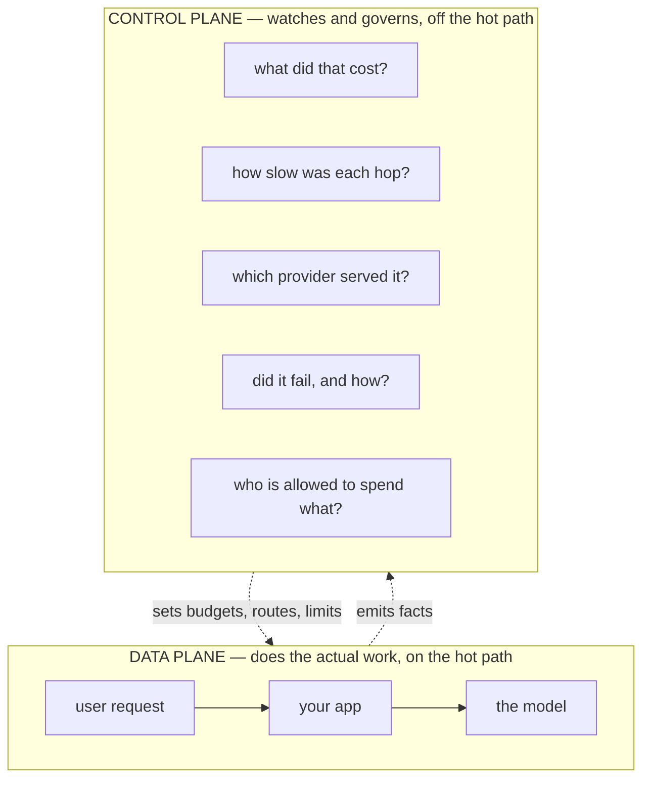
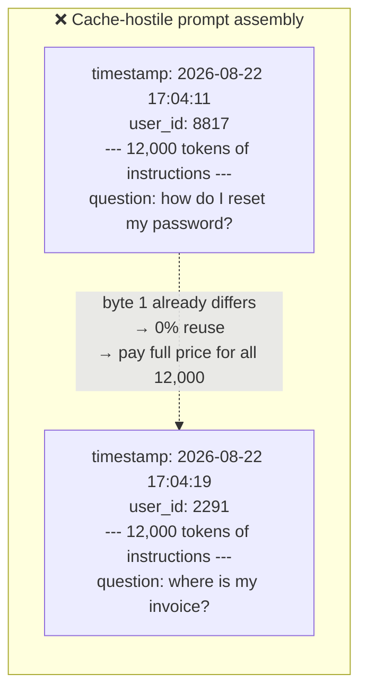
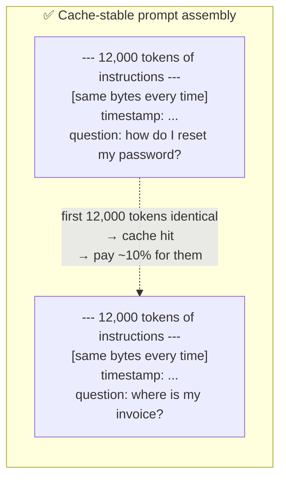
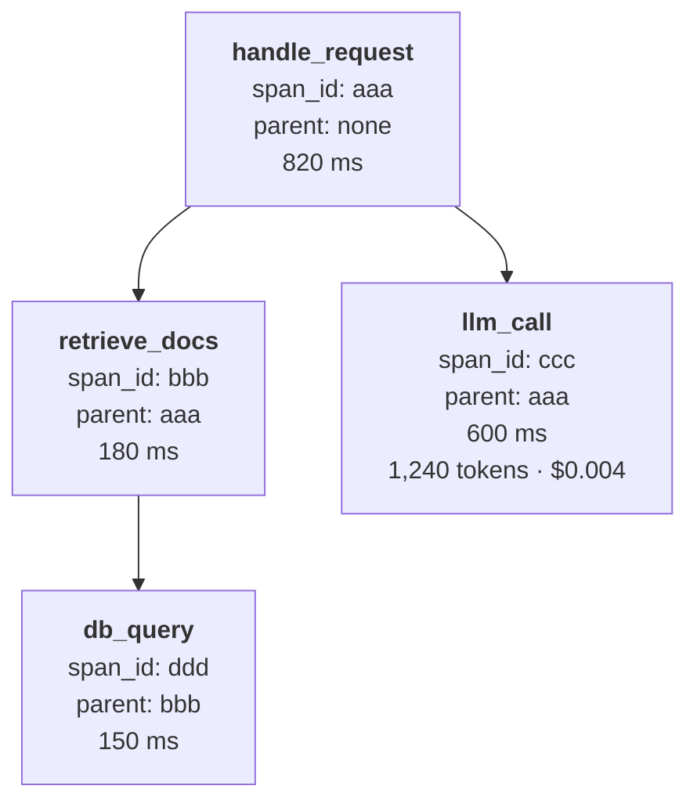
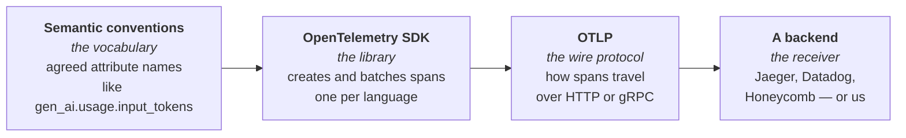
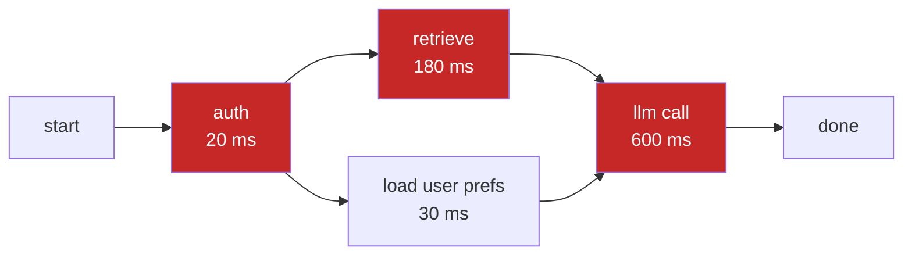
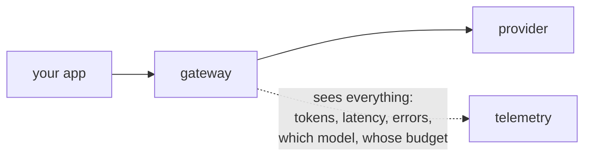
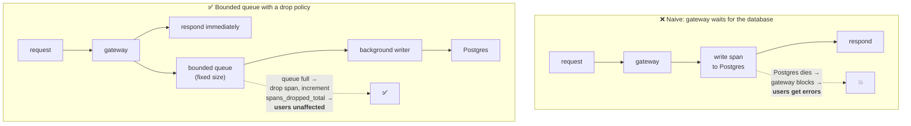
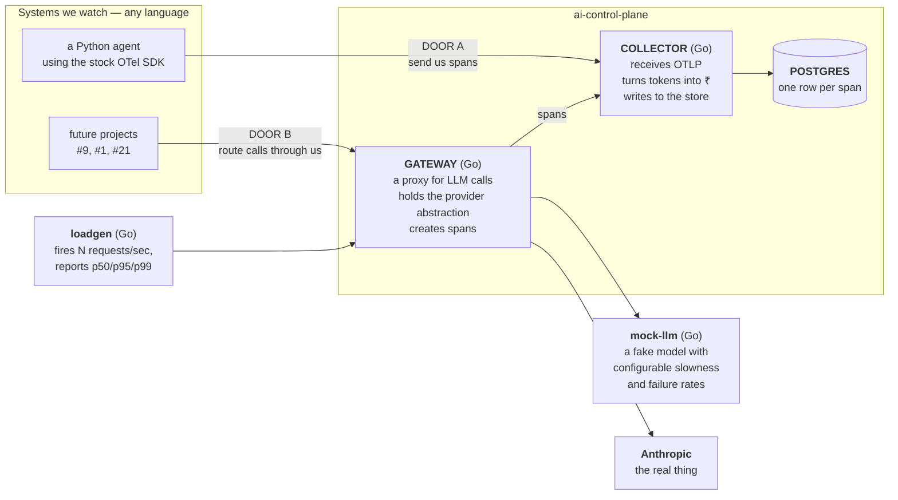

# Slice v1-00 — Concepts

**No code in this slice. Nothing to commit. Nothing to install.**

This exists because the plan file was written in vocabulary you have not needed yet as a Node
backend dev. That is a defect in the plan, not in you — a plan you cannot read is a plan you
cannot argue with, and arguing with it is the point.

Read this once. Then re-read the plan file. It should stop looking like jargon.

**Rule for this document:** every term is defined before it is used, and every concept ends with
*why we care* — because a concept with no consequence is trivia, and trivia does not survive an
interview.

**Viewing the diagrams:** press `Ctrl+Shift+V` in VS Code with this file open. The
`bierner.markdown-mermaid` extension is installed, so the diagrams render.

---

# Part 1 — What is a "control plane"?

## 1.1 The term is borrowed, and the borrowing is the point

The phrase comes from networking. In a network switch there are two separate jobs:

- **The data plane** — the part that actually moves packets. It is fast, dumb, and on the hot
  path. Every microsecond here matters.
- **The control plane** — the part that decides *how* packets should be moved: routing tables,
  policies, limits. It is slower, smarter, and off the hot path.

Kubernetes uses the same split. Your pods are the data plane; the API server, scheduler and
controllers are the control plane.



**Why use the industry's word instead of inventing one?** Because "I built an AI control plane"
tells a hiring manager you know the category exists and has prior art. "I built a thing that
logs LLM stuff" does not. Same system, different signal.

## 1.2 In Node terms

You have probably built the ad-hoc version of this without naming it: a `console.log` of how long
a request took, a `try/catch` that counts errors, a middleware that stamps a request ID. A control
plane is that instinct taken seriously and made into a system — one that works across many
services written in different languages, and that can answer questions you did not think to ask
when you wrote the log line.

## 1.3 Why LLM systems need one specifically

A normal REST endpoint is cheap and predictable. An LLM call is neither:

| | Normal API call | LLM call |
|---|---|---|
| Cost per call | effectively free | ₹0.10 to ₹40, and it varies per call |
| Latency | 5–50 ms | 500 ms – 60 s |
| Failure modes | 500, timeout | 500, timeout, rate limit, **stream dies at 90%**, **returns valid JSON that is wrong** |
| Output | deterministic | different every time |

You cannot run that on vibes. Somebody has to be able to answer "why did last Tuesday cost
₹40,000?" — and that somebody needs data that was collected *before* Tuesday.

---

# Part 2 — Tokens, and why they are money

## 2.1 What is a token?

A model does not read characters or words. It reads **tokens** — chunks of text, roughly 3–4
characters of English each. `"unbelievable"` might be three tokens: `un` + `believ` + `able`.

Rules of thumb worth memorising:

- ~750 English words ≈ 1,000 tokens
- Code tokenises *worse* than prose — more tokens per character
- **You are billed per token, separately for input and output**, and output costs ~5x input

Current Anthropic pricing, per **million** tokens:

| Model | Input | Output |
|---|---|---|
| `claude-haiku-4-5` | $1.00 | $5.00 |
| `claude-sonnet-5` | $3.00 | $15.00 |
| `claude-opus-5` | $5.00 | $25.00 |

So one request with a 10,000-token prompt and a 500-token answer on Sonnet costs
`10000/1e6 × $3 + 500/1e6 × $15` = $0.03 + $0.0075 = **$0.0375**. Sounds trivial. At 100,000
requests/day it is **$3,750/day**. This is why cost attribution is a job.

## 2.2 The thing almost nobody outside the field knows: the KV prefix cache

This is the single highest-value concept in this document. It is also the one your CLAUDE.md
specifically calls out as "the kind of thing a backend dev is assumed not to know."

**The mechanism.** When a model processes your prompt, it does a big matrix computation over
every token and builds an internal data structure — the **KV cache** (key/value cache). That
computation is most of what you pay for on the input side.

Here is the exploitable property: **if two requests start with the identical byte sequence, the
work done for that shared beginning can be reused.** The provider keeps the KV cache for the
prefix around for a few minutes and skips recomputing it.

It is a **prefix** match. Not a fuzzy match, not a similarity match. Byte-identical, from
position zero. One changed character anywhere invalidates everything after it.





**Same information. Same model. Same answer. Different order. Roughly 10x difference on the input
bill.**

That reordering — treating prompt assembly as an optimisation problem over
(priority, token count, cache-stability) — is portfolio project **#7**, and its whole pitch is a
dollar figure. Which brings us to why the control plane must get its arithmetic right.

## 2.3 There are four token counters, not two

Because of caching, the API does not return "input tokens" and "output tokens." It returns
**four** numbers:

| Field | Meaning | Price multiplier |
|---|---|---|
| `input_tokens` | tokens processed at full price — **the uncached remainder only** | **1.0x** |
| `cache_read_input_tokens` | tokens served from the cache | **~0.1x** |
| `cache_creation_input_tokens` | tokens written into the cache this request | **1.25x** (5-min TTL) or **2x** (1-hour TTL) |
| `output_tokens` | tokens the model generated | base output price |

The trap: **`input_tokens` is not your prompt size.**

```
actual prompt size = input_tokens + cache_creation_input_tokens + cache_read_input_tokens
```

An agent can run for an hour with `input_tokens` showing 4,000, because the other 200,000 came
from cache.

**Why this decides our build order.** Suppose we write the obvious cost engine:

```
cost = input_tokens × price_in + output_tokens × price_out
```

Now #7 does its work and takes the cache hit rate from 0% to 85%. What does our dashboard show?
**Nothing changes.** `input_tokens` shrinks, so it looks like the prompt got smaller, but we never
counted the cache fields at all, so we cannot show the actual saving — and we would have been
mis-reporting the cost by up to 10x the whole time.

So: **the control plane's cost engine is what makes #7 measurable.** That dependency is the reason
cost accounting is in Phase 0, and it is slice `v1-04`.

---

# Part 3 — Seeing inside a running system

## 3.1 Logs are not enough

You know logging. The problem with logs in a system of many services: they are *flat*. You get
40,000 lines with no reliable way to say "these 12 lines were all part of the same user request,
and this one caused that one."

**Distributed tracing** fixes that.

## 3.2 Span and trace — the two words

- A **span** = one unit of work, with a start time and an end time. "the HTTP handler ran",
  "we queried Postgres", "we called the model". Think: one stopwatch.
- A **trace** = all the spans belonging to one user request, linked into a tree.

Three ID fields do all the linking:

| Field | Purpose |
|---|---|
| `trace_id` | same value on every span in one request |
| `span_id` | unique per span |
| `parent_span_id` | the `span_id` of whatever caused this span |

That is the whole trick. Flat rows in a table, reassembled into a tree by following
`parent_span_id`.



Read that tree and you immediately know: the request took 820 ms, the model call was 600 ms of it,
and retrieval was 180 ms of which 150 ms was one Postgres query. **You did not need to guess.**

Everything in the plan called "the trace DAG" means this tree. Everything called
"critical path analysis" means finding the chain through it that actually determines the total —
which we will come back to in Part 4.

## 3.3 OpenTelemetry, OTLP, and semantic conventions — three different things

People say "OTel" for all three. They are distinct, and the distinction matters for our design.



- **OpenTelemetry (OTel)** — an open standard, plus SDKs for every language, for producing
  telemetry. Vendor-neutral by design.
- **OTLP** — OpenTelemetry Protocol. The format spans travel in. Protobuf over HTTP or gRPC.
  If you can receive OTLP, you can receive from any OTel SDK in any language.
- **Semantic conventions** — the agreed *names*. Everyone calls the model `gen_ai.request.model`,
  not `model` or `modelName` or `llm_model`. There is a specific set for GenAI workloads, and
  that is the one we adopt.

**Why this is a design decision and not a library choice.** We could invent our own span format
and ship an SDK. Then onboarding any project requires our library, in that language, maintained by
us. Instead: we receive OTLP and use the standard names. Any project points a config value at us
and works. **We ship no SDK.**

That is what "vendor-neutral wire contract" means in the plan, and it is why slice `v1-08`
onboards a Python program using only the stock OpenTelemetry library — proving the claim instead
of asserting it.

---

# Part 4 — Measuring honestly

## 4.1 The average is a lie

Ten requests, in milliseconds:

```
100, 105, 98, 102, 99, 101, 97, 103, 100, 4000
```

- **Average: 480 ms.** No request took 480 ms. The number describes nothing that happened.
- **p50 (median): 100.5 ms.** Half of requests were faster than this.
- **p95: ~4000 ms.** 95% were faster than this; 5% were this bad or worse.

**Percentile = "X% of requests were at least this fast."** p99 = the 99th slowest out of 100.

Why this matters commercially: if a page makes 20 API calls, and each has a 1% chance of being
slow, then **1 - 0.99²⁰ = 18%** of page loads hit at least one slow call. Your p99 is not a rare
edge case — it is roughly one in five of your users' actual experience. The average hides it
completely.

**Consequence for this project:** we never report an average. Every latency number in this repo is
p50 / p95 / p99, and CLAUDE.md §4 requires it "per hop, not an average over everything."

## 4.2 Latency vs throughput — different questions

- **Latency** = how long one request takes. Measured in ms.
- **Throughput** = how many requests per second the system handles. Measured in RPS/QPS.

They trade off. A system can have great latency at 10 RPS and fall apart at 1,000 RPS. This is why
the plan insists on a **load generator** (slice `v1-05`): you cannot discover that by clicking
around.

## 4.3 TTFT — a latency metric that only exists because of streaming

LLMs stream: tokens arrive one at a time, like an SSE feed. So there are two different "how fast":

- **TTFT — time to first token.** How long until *something* appears. This is what a user
  perceives as responsiveness.
- **Total latency.** How long until the answer is complete.

A response with 300 ms TTFT and 8 s total *feels* fast. One with 4 s TTFT and 5 s total feels
broken, despite being faster overall. Measuring only total latency would tell you the wrong one is
better.

## 4.4 The critical path

In the trace tree from Part 3, some spans run in parallel. The **critical path** is the chain of
spans that actually determines the total time — the one where making anything faster makes the
request faster.



The red chain is the critical path: 20 + 180 + 600 = 800 ms. "Load user prefs" takes 30 ms but
runs alongside retrieval, so **optimising it to zero saves you nothing.**

This is Amdahl's law, automated. It is the single most valuable analysis in project **#30-S**
later, and it is impossible unless `parent_span_id` is recorded correctly *now*. That is why the
plan lists it as a constraint inherited from a future project.

## 4.5 SLI and SLO

- **SLI — Service Level Indicator.** A thing you measure. "p99 gateway latency."
- **SLO — Service Level Objective.** A target for it. "p99 gateway latency ≤ 5 ms."

Why the plan states SLOs *before writing any code*: if you measure first and set the target
afterwards, you have not set a target — you have described whatever happened and called it
success. Stating it first means you can **miss**, and an honestly reported miss is a portfolio
asset. A quietly adjusted target is worthless.

---

# Part 5 — Not falling over

## 5.1 Gateway / proxy

A **proxy** sits between a client and a server and forwards traffic. A **gateway** is a proxy that
also does policy work — auth, rate limits, routing, logging.



**Why put one in front of an LLM?** Because it is the only place that sees every call without
every caller having to cooperate. Add a new service tomorrow, route it through the gateway, and it
is instrumented — no code in that service.

In Express terms: it is middleware, except it lives in its own process so it works for services
that are not Node.

## 5.2 Provider abstraction

One Go interface, several implementations behind it:

```
Provider interface:
    Chat(ctx, request) → (response, error)

implementations:  mock   anthropic   (bedrock, if quota ever exists)
```

The important discipline is not the interface — it is this: **which provider is used is a runtime
config value, never an `import` in business logic.** If your handler imports the Anthropic package
directly, you do not have an abstraction, you have a wrapper, and swapping providers is a rewrite.

This matters for us concretely: AWS Bedrock hands new accounts zero quota, so any design where
Bedrock is a hard dependency is a design that cannot run. Making it one adapter among several is
how you make a quota wall a config change instead of a crisis.

## 5.3 Backpressure and load shedding

**Backpressure** = what a system does when work arrives faster than it can be finished.

Three options, in increasing order of maturity:

| Strategy | What happens | Verdict |
|---|---|---|
| Queue it all | memory grows until the process is OOM-killed | ❌ collapses |
| Block the caller | requests pile up, connections exhaust, everything stalls | ❌ collapses, slower |
| **Bounded queue + drop** | queue has a fixed size; when full, deliberately discard, and count what you discarded | ✅ degrades |

**Degrading is the goal, not surviving perfectly.** A system that gets slightly worse under
overload is production-grade. One that is perfect until it dies is a toy.

The specific rule for a control plane, and it is the one we will prove the hard way in slice
`v1-07`: **drop telemetry before you ever drop user traffic.** Observability data is valuable.
It is not as valuable as the request the customer is waiting for.



**We are going to build the broken one first, on purpose.** Slice `v1-03` writes synchronously,
because that is the simple and obviously-correct-looking first version. Slice `v1-07` kills
Postgres under load and watches user traffic die with it. Then we fix it and measure the
difference.

Why deliberately build the wrong thing? Because "I built a queue because that's best practice" is
a sentence anyone can say. "I killed the database under 200 RPS, watched error rate go to 100%,
added a bounded queue with a drop counter, and error rate under the same fault is now 0% with p99
up 3 ms" is evidence. **The before-number is the deliverable.** Skip the broken version and you
have destroyed it.

## 5.4 Fail-open vs fail-closed

When a check cannot run, what do you do?

- **Fail-open** — let the request through. Prioritises availability.
- **Fail-closed** — reject the request. Prioritises safety.

A PII scanner that goes down: fail-closed, because leaking personal data is worse than an outage.
A telemetry writer that goes down: fail-open, because nobody's request should fail so we can log
it.

There is no universally right answer — the senior move is knowing it must be **configurable per
policy**, and being able to say why each one is set the way it is.

---

# Part 6 — Now re-read the architecture

Everything in the plan's diagram, in the words you now have:



| Piece | In one sentence |
|---|---|
| **Door A** | Anything that speaks OTLP can send us spans — no library of ours required. |
| **Door B** | Route your model calls through our gateway and you are instrumented for free. |
| **mock-llm** | A fake model so we can drive thousands of requests/sec for ₹0 and inject failures on demand. |
| **loadgen** | The benchmark harness. Produces the baseline every later claim is measured against. |
| **Postgres** | One row per span, with the frequently-queried fields as real columns. |
| **cost engine** | Four token counters × a dated price list = an honest rupee figure. |

---

# Done means

You can explain each of these to a skeptical senior engineer, out loud, without notes:

- [ ] Control plane vs data plane, and why the borrowed term is worth using
- [ ] Token; why output costs ~5x input
- [ ] KV prefix cache; **why reordering a prompt changes the bill**
- [ ] The four token counters, and why `input_tokens` is not the prompt size
- [ ] Span, trace, and how `parent_span_id` reconstructs a tree
- [ ] OTel SDK vs OTLP vs semantic conventions — three different things
- [ ] Why we ship no SDK
- [ ] Why the average is a lie; what p95 means; the 20-calls-and-18% argument
- [ ] TTFT vs total latency
- [ ] Critical path, and why optimising off it is wasted work
- [ ] SLI vs SLO, and why the target is stated before the code
- [ ] Backpressure; bounded queue and drop; degrade rather than collapse
- [ ] Fail-open vs fail-closed, with an example of each
- [ ] Why we are deliberately building the synchronous version first

**The honest test:** for each one, can you say *what breaks if you get it wrong?* If yes, you know
it. If you can only define it, you have memorised it — come back and ask.

---

# Out of scope for this slice

- Any code, any repo, any install.
- How OTLP protobuf is actually encoded — you do not need it; a library handles it.
- The internals of transformer attention. You need *that the KV cache exists and is prefix-shaped*,
  not the linear algebra.
- Sampling, ClickHouse, policy engines, evals — all later, all deliberately.

# Next

`v1-01` — walking skeleton. A Go HTTP server, a `Provider` interface, a fake adapter, one span
printed to the terminal. First commit.
